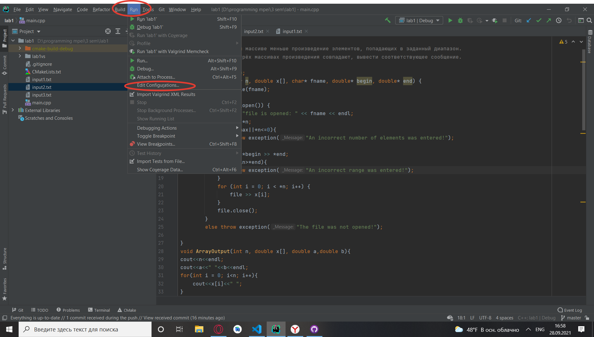
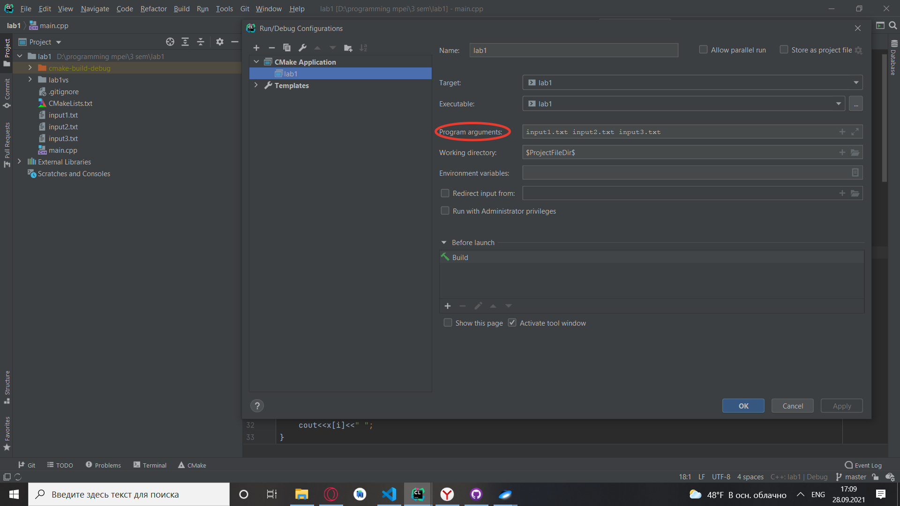

# Лабораторные работы по курсу "Языки и методы программирования" в НИУ МЭИ
Задания взяты с сайта [Конспект лекций по С/С++](http://natalia.appmat.ru/c%26c%2B%2B/index.php?sezione=compiti)
## Описание
Программы работают с аргументами функции main. Ниже приведена инструкция для разных редакторов
### Clion

В строке "Program arguments" вводим аргументы(в нашем случае - имена файлов) через пробел без посторонних символов.
Файлы должны быть в папке проекта, иначе нужно будет указать полный путь до каждого из них.

### Visual Studio 
[аргументы командной строки в Visual Studio](https://intuit.ru/studies/courses/627/483/lecture/10983)
